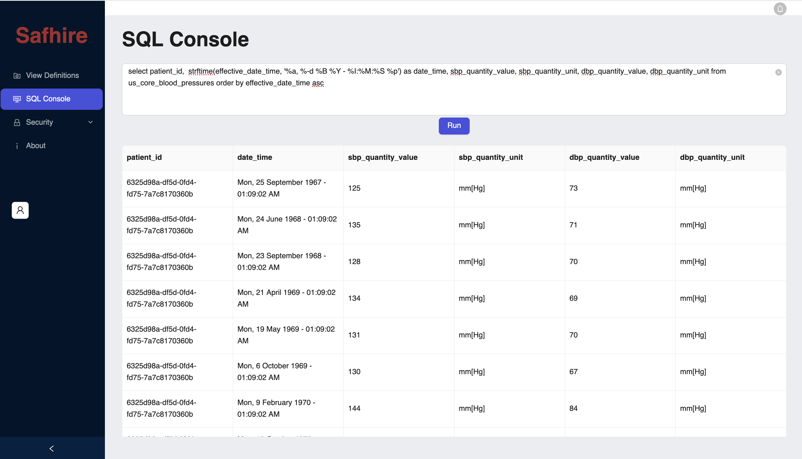

# safhire
Safhire(pronounced _Sapphire_) is an implementation of [SQL on FHIR](https://build.fhir.org/ig/FHIR/sql-on-fhir-v2/index.html) in Rust lang.

There are two variants, a CLI and a standalone server.

# Usage of CLI
```
./safhire --help
Usage: safhire [OPTIONS] --vdf <VDF> --resf <RESF>

Options:
  -v, --vdf <VDF>    Path to a ViewDefinition file or a folder containing ViewDefinition files
  -r, --resf <RESF>  Path to a FHIR resource file or a folder containing FHIR resources
  -n, --ndjson       Flag to indicate that the input FHIR resource files are in newline delimited JSON format
  -f, --fmt <FMT>    Output format, SQL or CSV [default: sql]
  -o, --od <OD>      Output Directory (writes to stdout when not specified)
  -h, --help         Print help
  -V, --version      Print version
```

# Standalone Server
Safhire server consists of a FHIR data processor and an embedded SQL engine. It exposes a REST API for data ingestion and executing SQL queries.

For example:
1. When a ViewDefinition like [us_core_blood_pressures](resources/us_core_blood_pressures.json) is configured
2. and a sample FHIR bundle like [Aaron697_Blick](resources/Aaron697_Blick.json) is sent to the processing endpoint https://localhost:7490/process
3. then Safhire can present the below data when queried



The built-in SQL console has very limited capabilities, however Safhire's REST endpoint for querying can be integrated with any Business Intelligence tool of your choice that can consume JSON data using REST API. 

The server variant is currently in private beta. If you are interested to know more, please send an email to [hello@sereen.io](mailto:hello@sereen.io).
